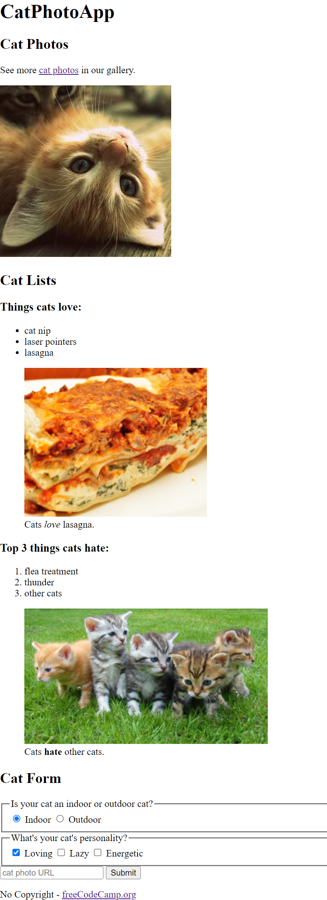

# FCC CAT PHOTOAPP

> A cat photoapp using HTML tags to add photos, buttons, and other elements to webpage.



Additional description of the project and its features.

## Built With
- HTML5 form elements
  - `h1`, `h2`, `select`, `form`, `button`, `fieldset`, `footer`, `section`,
  - `textarea`, `label`, `ìnput`, `option`, `img`, `figcaption` .
- Linters
  - [Prettier](https://prettier.io/),
  - [Stylelint](https://stylelint.io/).
- GitHub Action

## Live Demo

[Live Demo Link](https://fcc-catphotoapp-ismail.netlify.app/)

### Development (Running locally)

- Clone the project

```bash
git clone git@github.com:ismailadekunle/01-fcc-cat-photo-app.git

```

- Install Dependencies

```bash
yarn install
```

To run StyleLint by itself, you may run the lint task:

```bash
yarn lint:check
```

Or to automatically fix issues found (where possible):

```bash
yarn lint
```

You can also check against Prettier:

```bash
yarn format:check
```

and to have it fix (to the best of its ability) any format issues, run:

```bash
yarn format
```

You can also check against Webhint:

```bash
yarn hint
```

## Style Guides

- [CSS Style Guide](http://udacity.github.io/frontend-nanodegree-styleguide/css.html)
- [HTML Style Guide](http://udacity.github.io/frontend-nanodegree-styleguide/index.html)
- [JavaScript Style Guide](http://udacity.github.io/frontend-nanodegree-styleguide/javascript.html)
- [Git Style Guide](https://udacity.github.io/git-styleguide/)

## 👤 Author

- Github: [@ismailadekunle](https://github.com/ismailadekunle)
- Twitter: [@ismailadekunle](https://twitter.com/ismailadekunle)
- Linkedin: [@ismailAdekunleJIMOH](https://www.linkedin.com/in/ismailAdekunleJIMOH/)

## 🤝 Contributing

Contributions, issues and feature requests are welcome!

Feel free to check the [issues page](../../issues).

## Show your support

Give a ⭐️ if you like this project!

## Acknowledgments

- freecodecamp

## 📝 License
2023 Ismail Adekunle Jimoh
[MIT licensed](./LICENSE).
